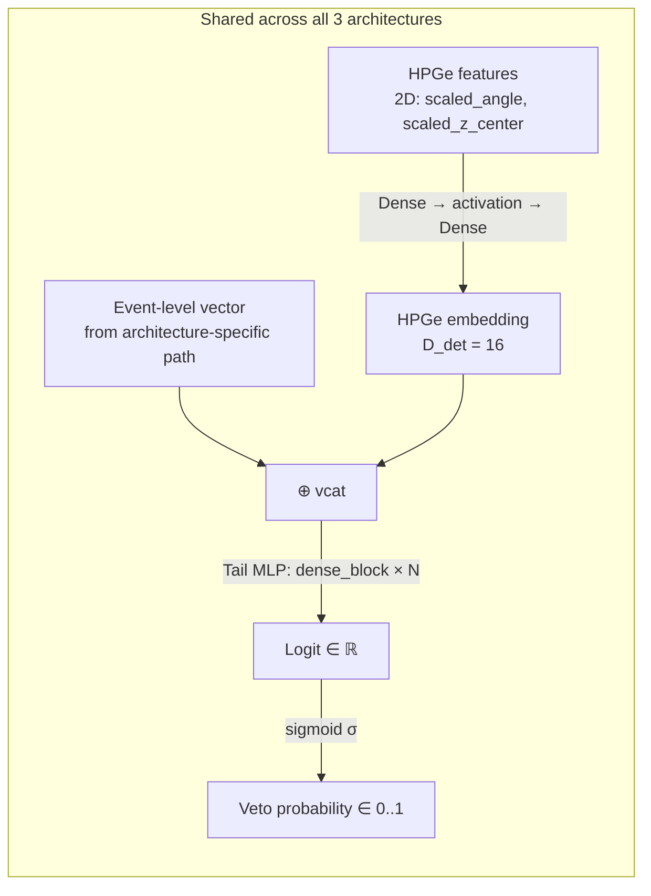
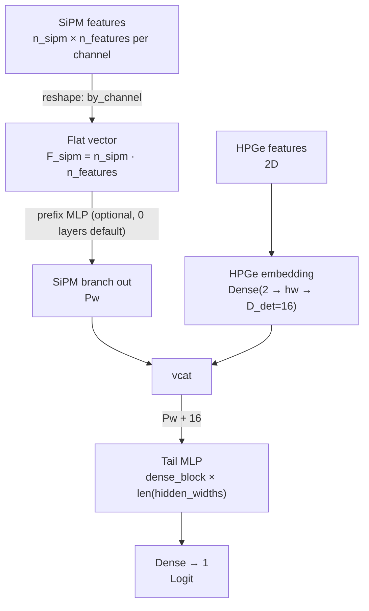
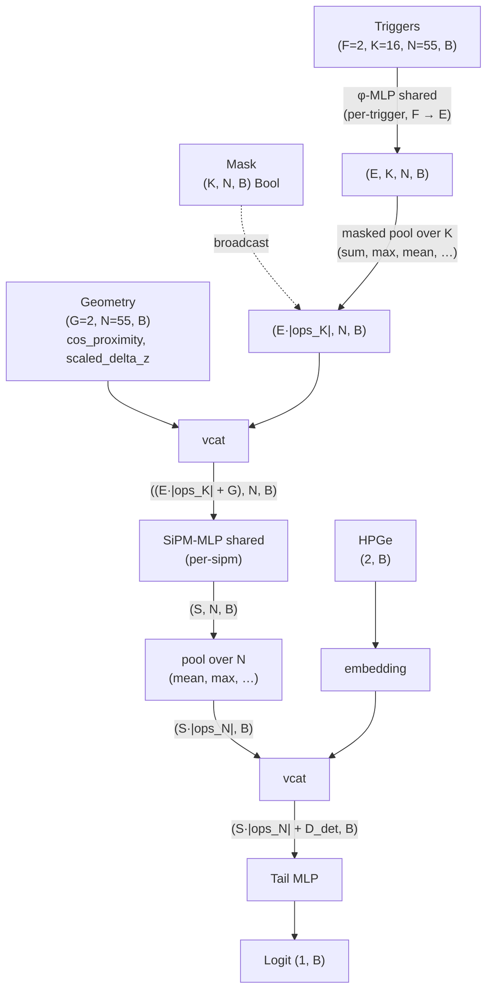
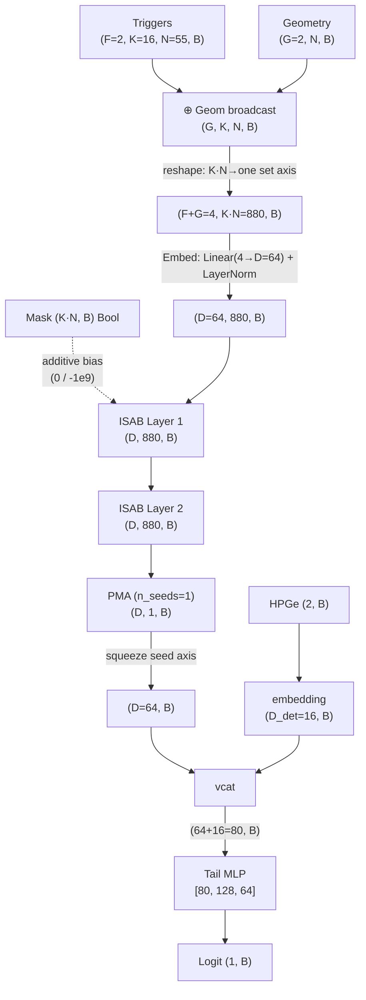
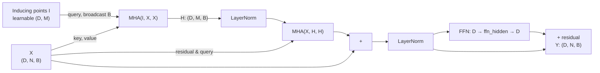

# Model Architectures

This document describes the three architectures currently registered in the
LAr-Veto pipeline. For each one it shows:

1. What it does conceptually
2. The data flow (Mermaid diagram + ASCII tensor shapes)
3. **Which hyperparameter sits where in the YAML** and what effect it has

The diagrams use Mermaid — renders natively on GitHub, GitLab, and in
VS Code (with the "Markdown Preview Mermaid Support" extension).

---

## Overview

| Architecture | Code | Trigger-level? | Complexity | When to use |
|---|---|---|---|---|
| `mlp_detector_concat` | [det_concat_mlp.jl](../src/ml/architectures/det_concat_mlp.jl) | No (PE sums) | Low | Baseline, fast, robust |
| `hierarchical_set` | [hierarchical_set.jl](../src/ml/architectures/hierarchical_set.jl) | Yes (Triggers → SiPM → Event) | Medium | When trigger timing matters and you want to exploit the physics hierarchy |
| `set_transformer` | [set_transformer.jl](../src/ml/architectures/set_transformer.jl) | Yes (all triggers as one set) | High | When cross-SiPM correlations matter and there is enough training data |

**Selection:** Which model is run per mlgroup is controlled by
[processing_config.yaml](../config/processing_config.yaml) via
`processors.process_training.kwargs.model`. The corresponding hyperparameters
come from `metadata/training/<group>.yaml`, in the block named after the model.

---

## Shared building blocks

All three models share these pieces:



**HPGe embedding** is built in [blocks.jl:74-91](../src/ml/layers/blocks.jl#L74-L91).
Configured via:

```yaml
input:
  hpge:
    enabled: true
    features: [scaled_angle, scaled_z_center]
    output_dim: 16          # → D_det
    hidden_width: 32        # hidden layer: 2 → 32 → 16
```

**Tail MLP** is a sequence of `dense_block` (Dense + optional BatchNorm +
activation + optional Dropout), followed by a final `Dense(→1)` for the logit.
Configured in the architecture-specific block of the YAML under
`architecture.tail`.

**Loss & optimizer:** Both come from the `training` block of the YAML. Default
is `loss: bce` (BinaryCrossentropy) and `optimizer: adamw`.

---

## 1. `mlp_detector_concat` — Baseline (PE-sum-based)

### What it does

Concatenates summed SiPM PE features (per channel, aggregated over time
windows) with the HPGe features and pushes the result through a standard MLP.
**No** trigger-level input — the time structure of individual photons is not
visible to the model.

### Data flow



### Tensor shapes (mlgroup001 default)

```
Inputs:
  sipm: (Pw, B)                Pw = 55 SiPMs · 3 features = 165
  det:  (2, B)

Branches:
  prefix(sipm) → (165, B)     # identity if concat_after_layers = 0
  det_embed(det) → (16, B)

Concat:
  → (165 + 16 = 181, B)

Tail (hidden_widths: [512, 256, 128, 64]):
  Dense(181→512) + BN + tanh + Dropout(0.27)
  Dense(512→256) + BN + tanh + Dropout(0.27)
  Dense(256→128) + BN + tanh + Dropout(0.27)
  Dense(128→64)  + BN + tanh + Dropout(0.27)
  Dense(64→1)
  → (1, B)                     # Logit
```

### Hyperparameter map

YAML block: `mlp_detector_concat:` in `metadata/training/<group>.yaml`.

| YAML path | Meaning | Where in code |
|---|---|---|
| `input.sipm.features` | Which per-channel features go in, e.g. `[sipm_pe_sums_prompt_scaled, sipm_pe_sums_delayed_scaled, cos_proximity]` | [det_concat_mlp.jl:40](../src/ml/architectures/det_concat_mlp.jl#L40) |
| `input.sipm.layout` | `by_channel` (interleaved) vs. `by_feature` | [det_concat_mlp.jl:79](../src/ml/architectures/det_concat_mlp.jl#L79) |
| `input.sipm.ordering.enabled` | Sort SiPM channels by geometry groups | Pipeline level (features.jl) |
| `input.hpge.features` / `output_dim` / `hidden_width` | Shape of the HPGe embedding | [blocks.jl:74](../src/ml/layers/blocks.jl#L74) |
| `architecture.hidden_widths` | Tail-MLP layers, e.g. `[512, 256, 128, 64]` | [det_concat_mlp.jl:43](../src/ml/architectures/det_concat_mlp.jl#L43) |
| `architecture.activation` | `relu` / `gelu` / `swish` / `tanh` | [blocks.jl:12](../src/ml/layers/blocks.jl#L12) |
| `architecture.dropout` | Dropout probability after each activation | [det_concat_mlp.jl:46](../src/ml/architectures/det_concat_mlp.jl#L46) |
| `architecture.batch_norm` | BatchNorm between Dense and activation? | [blocks.jl:32](../src/ml/layers/blocks.jl#L32) |

**Make the model deeper / wider:** extend `hidden_widths` or push the early
values up. `[1024, 512, 256, 128, 64]` for example for more capacity.

**Regularize harder:** raise `dropout` (e.g. 0.4), raise `weight_decay` (in the
training block).

---

## 2. `hierarchical_set` — Triggers → SiPM → Event

### What it does

Mirrors the natural physics hierarchy:

1. **Trigger level**: every photon trigger goes through a small MLP `φ`
   (shared weights across all triggers, all SiPMs, all events)
2. **SiPM level**: pool the `K` triggers of one SiPM, append SiPM geometry,
   push through a SiPM MLP
3. **Event level**: pool the `N` SiPMs of the event, concat with HPGe, push
   through the tail MLP

### Data flow



### Tensor shapes (mlgroup001 default)

```
Inputs:
  trig: (F=2, K=16, N=55, B)   # F = trig_time_scaled, trig_pe_scaled
  mask: (K=16, N=55, B) Bool   # padding mask
  geom: (G=2, N=55, B)          # cos_proximity, scaled_delta_z
  det:  (2, B)

φ-MLP (hidden_widths: [16, 16]):
  reshape (2, 16·55·B) → MLP(2 → 16 → 16) → reshape (16, 16, 55, B)

Pool over K (ops: [sum, max]):
  → (16·2 = 32, 55, B)

vcat geom (G=2):
  → (32 + 2 = 34, 55, B)

SiPM-MLP (hidden_widths: [24]):
  reshape (34, 55·B) → MLP(34 → 24) → reshape (24, 55, B)

Pool over N (ops: [mean, max]):
  → (24·2 = 48, B)

vcat HPGe embedding:
  → (48 + 16 = 64, B)

Tail (hidden_widths: [64]):
  Dense(64→64) + BN + tanh + Dropout(0.45) → Dense(64→1)
  → (1, B)
```

### Hyperparameter map

YAML block: `hierarchical_set:` in `metadata/training/<group>.yaml`.

| YAML path | Meaning | Effect when raised |
|---|---|---|
| `input.triggers.features` | Per-trigger input features, e.g. `[trig_time_scaled, trig_pe_scaled]` | Larger F → more info per trigger |
| `input.triggers.max_per_sipm` | K = max triggers per SiPM (padding cap) | More detail on high-photon events, but more memory |
| `input.sipm.geometry` | G geometry features at the SiPM level | More SiPM context |
| `architecture.phi.hidden_widths` | φ-MLP layers (per-trigger embedding) | Deeper / wider trigger embedding |
| `architecture.phi.dropout` / `batch_norm` | Regularization in φ | Less overfitting |
| `architecture.pooling.ops` | How to aggregate over the K triggers? `[sum, max, mean]` | More ops → richer SiPM representation, but `Eκ` grows |
| `architecture.sipm_mlp.hidden_widths` | SiPM-MLP layers | Deeper SiPM embedding |
| `architecture.event_pooling.ops` | How to aggregate over the N SiPMs? `[mean, max]` | More ops → richer event vector |
| `architecture.tail.hidden_widths` | Final MLP layers | More capacity for classification |

**Make the model deeper:** set `phi.hidden_widths: [32, 32]` and
`sipm_mlp.hidden_widths: [48]` (doubled from default).

**More pooling info:** `pooling.ops: [sum, max, mean]` instead of `[sum, max]`.

**Important — no BatchNorm in φ / SiPM MLP:** The `PerElementModel` wrappers
run over `K·N·B ≈ 200k` "samples" per forward — the cuDNN BN path breaks down
there. Either keep `batch_norm: false` or use LayerNorm. See the warning in
[set_ops.jl:23-31](../src/ml/layers/set_ops.jl#L23-L31).

---

## 3. `set_transformer` — Flat set + attention

### What it does

Instead of explicitly modeling the Triggers → SiPM → Event hierarchy, the Set
Transformer throws **all** triggers of an event (K · N = up to 880) into
**one** set and uses self-attention via inducing points (ISAB), so arbitrary
cross-SiPM correlations can be learned. Pooling at the end is via PMA
(Pooling by Multihead Attention) instead of mean/max.

### Data flow



### ISAB in detail

ISAB (Induced Set Attention Block) cuts the `O(N²)` attention cost down to
`O(N·M)` via M learnable inducing points:



PMA (Pooling by Multihead Attention) is similar, but uses `n_seeds` learnable
seed vectors as queries — yielding a fixed-size output `(D, n_seeds, B)`.

### Tensor shapes (mlgroup001 default, D=64, M=16)

```
Inputs:
  trig: (F=2, K=16, N=55, B)
  mask: (K=16, N=55, B) Bool
  geom: (G=2, N=55, B)
  det:  (2, B)

Geom broadcast + concat:
  geom (G, N, B) → (G, K, N, B)
  vcat trig → (F+G=4, K, N, B)

Flatten into one set:
  reshape → (4, 880, B)              # K · N = 880 set tokens
  mask_flat (880, B) Bool

Embed:
  Linear(4 → 64) + LayerNorm → (64, 880, B)

ISAB × 2 (n_inducing=16, n_heads=4, ffn_hidden=128):
  each layer: (64, 880, B) → (64, 880, B)
  internal attention map: (16, 880, 4, B) instead of (880, 880, 4, B)

PMA (n_seeds=1, n_heads=4):
  Query: (64, 1) seed → MHA → (64, 1, B) → squeeze → (64, B)

vcat HPGe embedding:
  → (64 + 16 = 80, B)

Tail (hidden_widths: [80, 128, 64]):
  Dense(80→80) + tanh + Dropout
  Dense(80→128) + tanh + Dropout
  Dense(128→64) + tanh + Dropout
  Dense(64→1) → (1, B)
```

### Hyperparameter map

YAML block: `set_transformer:` in `metadata/training/<group>.yaml`.

| YAML path | Meaning | Effect when raised |
|---|---|---|
| `input.triggers.features` | F per-trigger features | More info per trigger |
| `input.triggers.max_per_sipm` | K = max triggers per SiPM | Longer set sequence `K·N` → quadratically more memory in attention |
| `input.sipm.geometry` | G per-SiPM geometry features (broadcast onto each trigger) | More geom context |
| `architecture.embed.out_dim` | **D** — embedding width, end-to-end | Linearly more memory, ~quadratically more attention cost |
| `architecture.embed.layer_norm` | LayerNorm after the linear embed? | Stability |
| `architecture.isab.n_layers` | **L** — how many ISAB layers stacked | Deeper → more capacity, linearly more cost / memory |
| `architecture.isab.n_heads` | h — how many attention heads per ISAB | Finer sub-attention, ~linearly more memory |
| `architecture.isab.n_inducing` | **M** — bottleneck size, attention cost ∝ N·M | More detail in the bottleneck representation, linearly more expensive |
| `architecture.isab.ffn_hidden` | hidden layer in the ISAB's FFN block (default 4·D) | More per-token capacity |
| `architecture.isab.attention_dropout` | Dropout on attention weights | More regularization |
| `architecture.pma.n_seeds` | k — number of seed vectors for the pooling attention | k=1 is enough for binary classification; >1 if you want multiple sub-representations |
| `architecture.pma.n_heads` | Heads for the pooling MHA | Same as ISAB |
| `architecture.tail.hidden_widths` | Tail-MLP layers | More classification capacity |

**Make the model stronger (more params):** `embed.out_dim: 128` (was 64),
`isab.n_layers: 4` (was 2), `isab.n_inducing: 32` (was 16). Caveat: probably
won't fit batch=1024 on a 40GB A100 → drop batch back to 512.

**Make the model leaner:** `isab.n_layers: 1`, `isab.n_inducing: 8`,
`embed.out_dim: 32`. Faster but less capacity.

**Important note** about the custom MHA path in
[attention.jl:91](../src/ml/layers/attention.jl#L91): a Zygote-AD bug with
`-Inf` in the mask forced a replacement of the standard Lux MHA path —
if you migrate to Enzyme/Reactant, it's worth refactoring back to the standard
path (cuDNN flash-attention).

---

## Hyperparameter cheat sheet (all 3 side by side)

This is the quick reference: same concept, different YAML paths.

| Concept | `mlp_detector_concat` | `hierarchical_set` | `set_transformer` |
|---|---|---|---|
| **Wider model** | bump `architecture.hidden_widths` | bump `phi.hidden_widths` and `sipm_mlp.hidden_widths` | bump `architecture.embed.out_dim` |
| **Deeper model** | more entries in `hidden_widths` | more entries in `phi.hidden_widths` / `tail.hidden_widths` | raise `architecture.isab.n_layers` |
| **Higher trigger resolution** | n/a (uses PE sums) | bump `triggers.max_per_sipm` (K grows, more RAM) | same (K·N grows — attention cost ∝ K·N·M) |
| **More trigger features** | n/a | extend `triggers.features` (F ↑) | same |
| **Stronger regularization** | `dropout`, `weight_decay`, maybe `batch_norm` | `phi.dropout`, `sipm_mlp.dropout`, `tail.dropout` | `isab.attention_dropout`, `tail.dropout` |
| **Change HPGe info** | `input.hpge.{features, output_dim, hidden_width}` | same | same |

---

## Mermaid tip

If you view this doc locally in VS Code and the diagrams don't render, you
need the **"Markdown Preview Mermaid Support"** extension (Bjorn-bringert).
On GitHub and GitLab it works out-of-the-box.

If you add your own architecture diagrams, here's the syntax quick-ref:

```
flowchart TD            # top-down
flowchart LR            # left-right
A[Rectangle] --> B(Oval)
B -->|"Edge label"| C[[double border]]
A -.-> D                # dashed line
subgraph NAME["Group"]
    X --> Y
end
```

---

## References

- Lee, J. et al. (2019). "Set Transformer: A Framework for Attention-based
  Permutation-Invariant Input." ICML 2019.
- Zaheer, M. et al. (2017). "Deep Sets." NeurIPS 2017.
